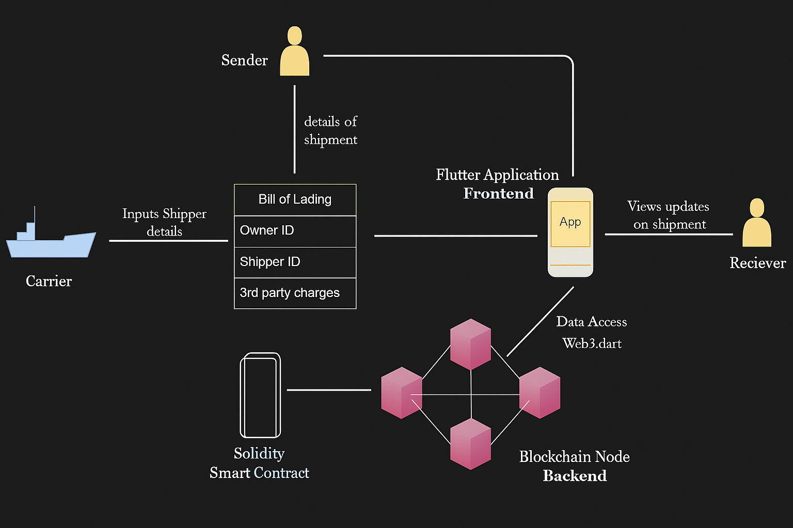

# Supply Chain - Bill of Lading (Blockchain-Based)

This project is a full-stack blockchain-based solution for securing and tracking **Bills of Lading** in a **Supply Chain** using **IoT**, **Ethereum Smart Contracts**, and a **Flutter Mobile App** interface.

---

## Overview

The Bill of Lading is a crucial legal document in the supply chain, often prone to fraud or loss. This system ensures secure, traceable, and real-time validation of goods using:

- Blockchain (Ethereum) for decentralized, tamper-proof records.
- Flutter frontend for intuitive user interaction.
- Python backend for contract interaction and data handling.
- IoT integration via Arduino to collect sensor data in real time.

---

## Why This Project

The maritime and logistics industries still heavily depend on physical documents like the **Bill of Lading (BoL)**, which are vulnerable to loss, delays, fraud, and manipulation. There is also:

- A lack of transparency among exporters, importers, banks, customs authorities, etc.
- Little to no accountability for delays or thefts.
- Paper-based inefficiencies and environmental concerns.

This project digitizes and decentralizes the BoL using blockchain to offer:

- Tamper-proof, immutable records.
- A decentralized ledger accessible by all stakeholders.
- A digital transformation toward paperless operations.

---

## How the System Works

<div align="center">
  
</div>

### System Components:
1. **IoT Module (Arduino):** Gathers sensor data (e.g., temperature).
2. **Python Backend Server:** Middleware between frontend and blockchain.
3. **Ethereum Blockchain (Private):** Stores shipment and BoL data.
4. **Flutter App:** Interface for shipper and receiver to interact with data.

### End-to-End Flow:

1. **Order Placement**
   - User inputs Order ID and Shipper ID through the Flutter app.
   - Data is transmitted to the backend and appended to the smart contract.

2. **Smart Contract Interaction**
   - The smart contract stores transaction data, payment status, and BoL info.
   - Data is immutable and transparently accessible.

3. **IoT Integration**
   - Arduino collects live shipment data (optional).
   - Can be sent to backend and integrated into smart contract if needed.

4. **Frontend Interaction**
   - Users (e.g., receivers) view BoL, status, and shipment details in the app.
   - Data fetched from blockchain via web3dart library.

---

## Project Structure

```
Supply-Chain---Bill-of-Lading-main/
│
├── Iot/                      # Arduino code for IoT devices
│   └── Iot.ino
│
├── Python Server/           # Backend to interact with smart contracts
│   ├── Server.py
│   ├── Test1.json           # ABI for smart contract
│   └── contract_address.txt # Deployed contract address
│
├── Solidity/                # Smart contracts and Truffle config
│   ├── contracts/test1.sol
│   ├── migrations/
│   ├── build/contracts/
│   └── truffle-config.js
│
├── front_end/               # Flutter mobile app
│   ├── android/
│   ├── ios/
│   ├── lib/
│   ├── pubspec.yaml
│   └── ...
```

---

## Features

- Real-time updates on shipment status.
- Immutable smart contract-based bill tracking.
- Cross-platform Flutter mobile interface.
- IoT integration for automatic sensor data capture.
- Secure data interactions using Ethereum blockchain.

---

## Technologies Used

- **Frontend:** Flutter (Dart)
- **Backend:** Python
- **Blockchain:** Solidity, Ethereum, Truffle
- **IoT:** Arduino (C++)

---

## Getting Started

### 1. Prerequisites

- Node.js & Truffle
- Ganache CLI or GUI
- Python 3.x
- Flutter SDK
- Arduino IDE

### 2. Setup Blockchain

```bash
cd Solidity
truffle compile
truffle migrate
```

### 3. Run Python Backend

```bash
cd "Python Server"
pip install -r requirements.txt  # (If requirements.txt exists)
python Server.py
```

### 4. Launch Flutter App

```bash
cd front_end
flutter pub get
flutter run
```

---

## IoT Setup

Upload `Iot.ino` to an Arduino board connected with relevant sensors. The data will be transmitted to the backend or blockchain based on configuration.

---

## License

This project is licensed under the [MIT License](LICENSE).

---

## Contact

For any queries or collaboration, please contact [jaganjgun008@gmail.com].
